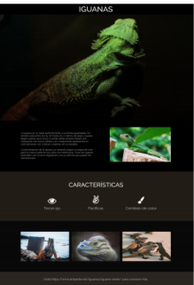

# Iguana Page 

## Descripcion de la solución

## ¿Qué hace el proyecto? 
Iguanas es un proyecto realizado en el contexto de ser la  una de las evaluaciones del módulo Fundamentos de desarrollo 
front-end, en el programa de desarrollo de aplicaciones Full Stack Javascript.

En el cual se evaluaron los siguientes contenidos: 

- Aplicar las etiquetas semánticas de HTML5, para agrupar el contenido, darle sentido
y forma a las diferentes secciones que componen la página web.
- Emplear adecuadamente los selectores para definir reglas por id, clase y/o etiqueta,
en los archivos de estilo CSS.
- Implementar estilos CSS texto, color, fondo, alineación, imágenes y el modelo de
cajas, para la definición de aspectos visuales de una interfaz web.
- Implementar estilos CSS, utilizando el modelo de cajas y las propiedades display,
unidades de medida y estilos tipográficos avanzados, para la definición de aspectos
visuales de una interfaz web.
- Implementa estilos CSS, utilizando las propiedades display, unidades de medida y
estilos tipográficos, para la definición de aspectos visuales de una interfaz web.

Con el propósito de evidenciar datos acerca de las Iguanas así como sus características.

## Instalación del Proyecto: 

para poder instalar y hacer correr el proyecto en nuestro local es necesario: 
- clonar el proyecto y abrir directamente.

## Dependencias:

Las herramientas utilizadas son: 
- HTML
- CSS

## Estilos:

Toda el desafío fue desarrollado solo a partir de una  hoja de estilo en cascada (CSS).

## Visualización
De forma general, se logra visualizar de la siguiente manera:

